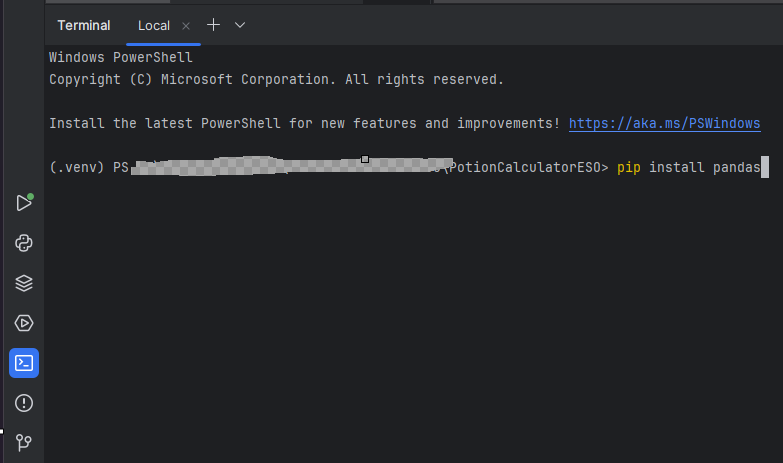
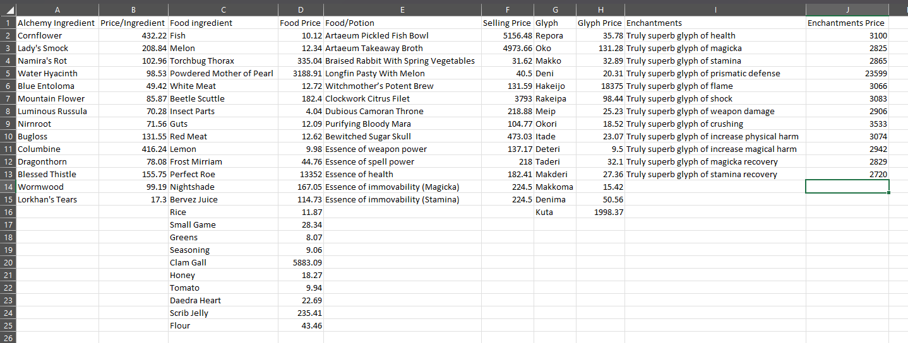
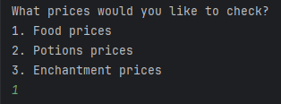
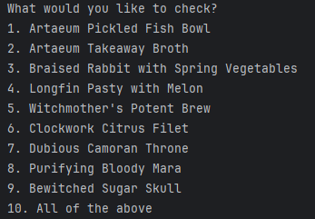
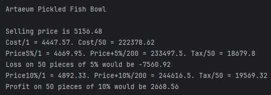
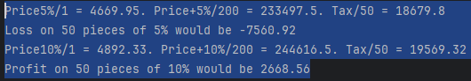
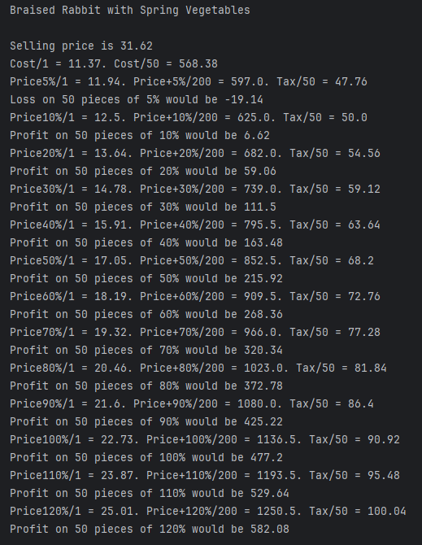
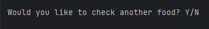

# Profit calculator Elder Scrolls Online

This is my first project using the Pandas library. The project was done back in 2019 and it probably took me like 2-3 days until I managed to finish it given how much hard codding I implemented in it. I had the idea in mind but I was not that experienced with programming, so I did a lot of raw and hard codding programming.

Now, before I talk about the project, I have to talk about the Elder Scrolls Online (ESO) video game in order to give some context to it. ESO is a video game in which you can craft different food, drinks and enchantments and you can sell them after. Each of them is crafted using 2-3 ingredients, deppending on the recipe.
The game had a plugin with which you could extract the average selling price of all ingredients and all the foods and drinks and etc.

I used that plugin to extract the prices into an excel file, and I used the Pandas library to play around with the data.

## Table of content

- [Installation](#installation)
- [Usage](#usage)

## Installation

1. Clone the repository
2. Open the terminal in your PyCharm or preferred IDE, and type the following command: pip install pandas

## Usage

1. First, we can open the Excel file PotStonks.xlsx and see the average selling prices for gold (in-game currency) of all the ingredients and craftables.

2. We can close the Excel file and run the main.py program. We will see this screen here:

3. For the purpose of this example, we will choose 1. Food prices. You will encounter this screen next. All of the options are in-game food recipes.

4. Picking 10. All of the above will give you a list with all the prices for all the food recipes. To break down the outcome for a recipe we have the following:

Artaeum Pickled Fish Bowl - The name of the recipe

Selling price is 5156.48 - The average selling price pulled with the plugin.
Cost/1 = 4447.57. Cost/50 = 222378.62 - The cost of crafting the specific recipe if you would choose to buy the ingredients instead of the final recipe. We have 2 options here, price per 1 piece or price per 50 pieces.

This next section is how much profit you can add until your selling price will reach the average price in the market. For this recipe we can see we can add up to 10% to our crafting price until we reach the market price.
For example, we will craft it with aprox 4447 gold per piece, and we can add up to 10% profit, to sell it with 4892 gold per piece.

Another example we have here is this recipe that sells for 31.62 gold, but we can buy the ingredients to craft it and it would cost us only 11.37 gold. We can add up to 120% profit per piece until we reach the average price.

5. After we are done with food, we see this message: inputting Y will return us to the main menu, while inputting N will stop the program.

6. You can check the prices for every craftable in the game and decide what you would like to buy or sell.

As a final note, I know the program is far from perfect or ideal, this is a beginner's touch on Python and Pandas library, but I had a lot of fun creating this and I made tons of in-game gold using it for over 1 year of playing the game.